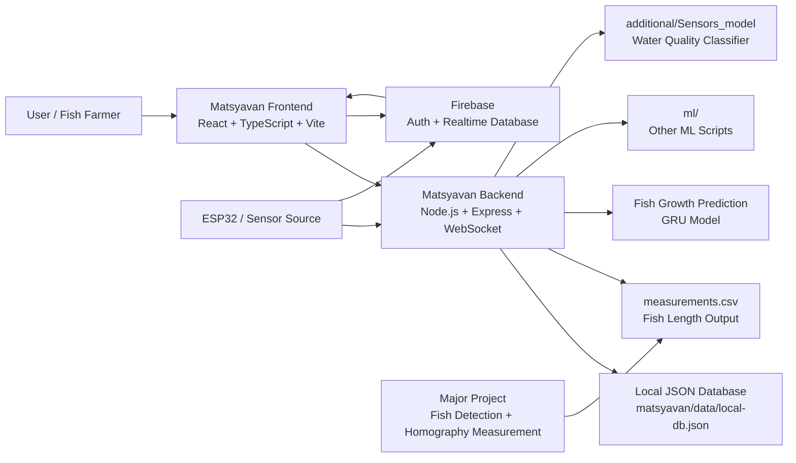
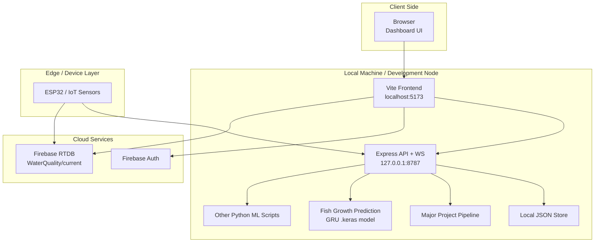
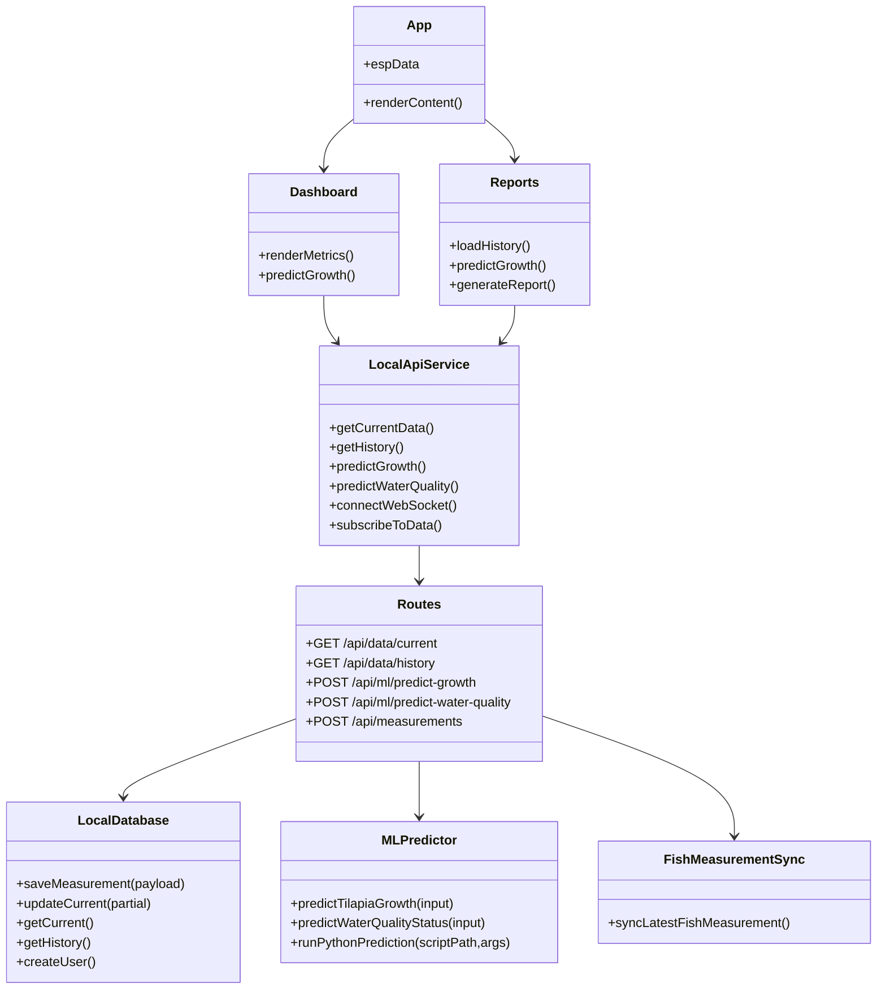
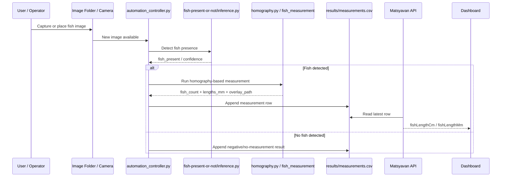
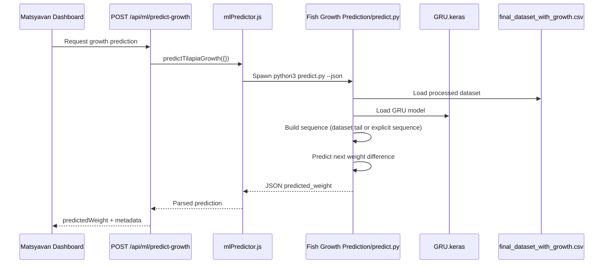
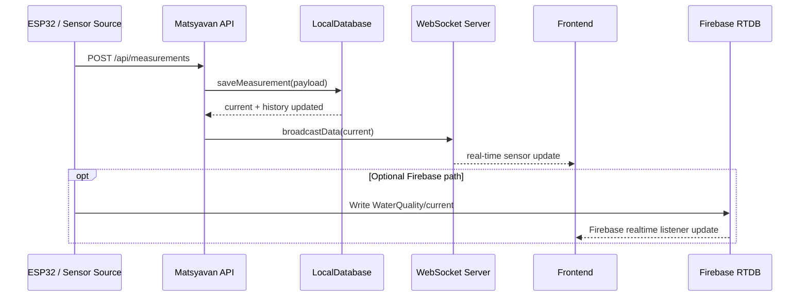
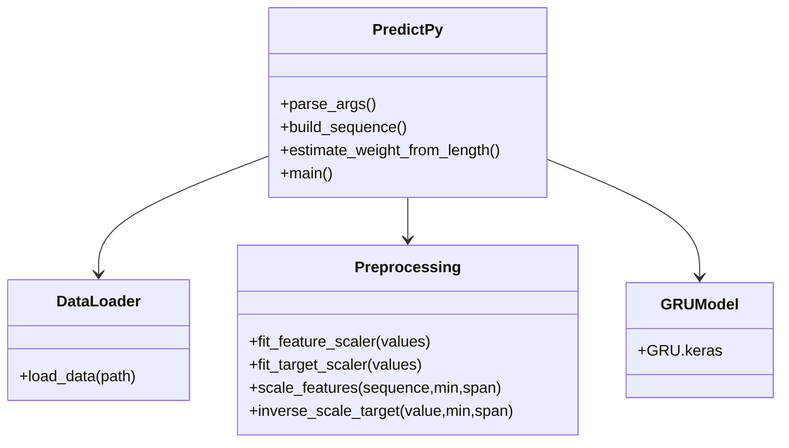
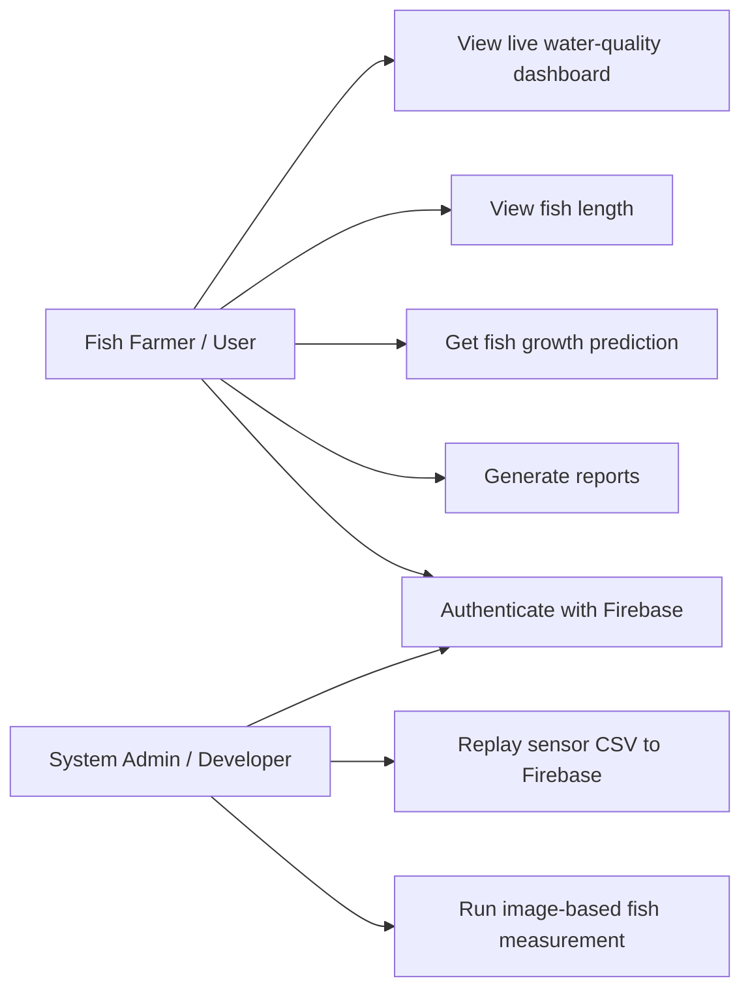
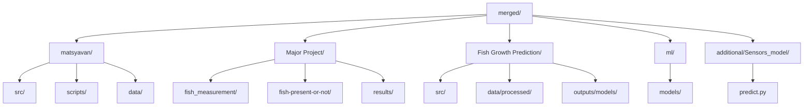

# Project UML

This document provides UML-style diagrams for the current merged project workspace.

Scope covered:

- `matsyavan/`
- `Major Project/`
- `Fish Growth Prediction/`
- `additional/Sensors_model/`
- `ml/`

The diagrams below use Mermaid so they can be rendered directly in compatible Markdown viewers.

## 1. High-Level Component Diagram

## 2. Deployment Diagram

## 3. Matsyavan Internal Class Diagram

## 4. Fish-Length Measurement Workflow Sequence Diagram

## 5. Fish Growth Prediction Sequence Diagram

## 6. Sensor Ingestion Sequence Diagram

## 7. Fish Growth Prediction Module Class Diagram

## 8. Use Case Diagram

## 9. Package / Module Relationship Diagram

## Notes

- The current project is hybrid:
  - local API + WebSocket
  - Firebase Auth
  - optional Firebase RTDB
- Fish-length estimation is sourced from `Major Project/results/measurements.csv`
- Fish growth prediction is currently sourced from `Fish Growth Prediction/predict.py`
- Additional ML scripts remain in `ml/` and `additional/Sensors_model/`, even if they are not the primary live dashboard path

## Suggested Usage

For:

- report: use diagrams 1, 4, 5, and 6
- viva/presentation: use diagrams 1, 2, and 8
- developer docs: use diagrams 3, 7, and 9
